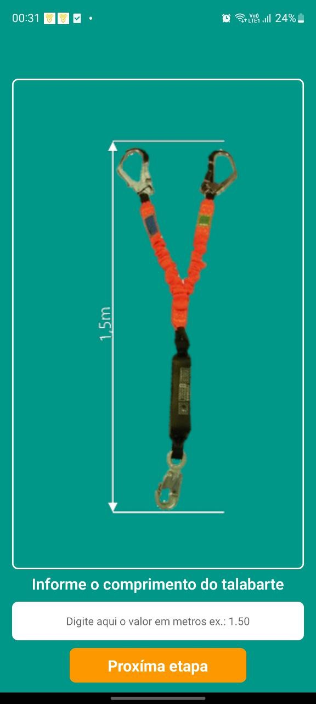
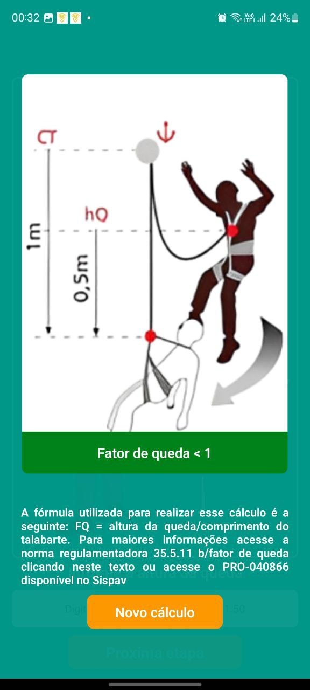

# Fall Factor Calculator in React Native

This is the source code of a React Native application that implements a Fall Factor Calculator, used in height work contexts according to regulatory standard NR-35. The application allows calculating the fall factor based on the fall height and the length of the lanyard.

## How to use the application

1. **Enter the Lanyard Length:**
   - Initially, the user must enter the length of the lanyard. The lanyard's length is an important factor in determining the fall factor.

2. **Enter the Fall Height:**
   - Next, the user should enter the fall height. The formula used for the calculation is: FF = fall height / lanyard length.
  

    
    

3. **Result Visualization:**
   - After entering the values, the user can visualize the calculation result. The application provides visual feedback indicating whether the fall factor is less than 1, equal to 1, or greater than 1.

  
  
  
  

## Code Structure

- The code uses React Native to build the user interface.
- Components like `TextInput`, `TouchableOpacity`, and `Image` are imported from React Native to create interactive and visual elements.
- The logic for calculation and state manipulation is managed through the use of hooks, especially `useState`.
- Styling is done using the `react-native-animatable` package for animations and predefined styles in the `styles.js` file.

## Additional Features

- The application has visual animations to indicate user attention.
- Representative images are displayed based on the calculation result.
- A link is provided to access additional information about fall factors in NR-35.

## How to Run the Project

1. **Install Dependencies:**
   - Make sure you have Node.js and React Native installed.
   - Run `npm install` to install project dependencies.

2. **Run the Application:**
   - Execute `npx react-native run-android` or `npx react-native run-ios` to start the application on the emulator or physical device.

3. **Note:**
   - Ensure you have a React Native development environment set up correctly to ensure proper execution.
