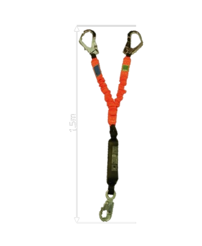

# Calculadora de Fator de Queda em React Native

Este é o código-fonte de uma aplicação React Native que implementa uma calculadora de Fator de Queda, utilizada em contextos de trabalho em altura conforme a norma regulamentadora NR-35. A aplicação permite calcular o fator de queda com base na altura da queda e no comprimento do talabarte.

  
  

## Como usar a aplicação

1. **Informe o Comprimento do Talabarte:**
   - Inicialmente, o usuário deve informar o comprimento do talabarte. O comprimento do talabarte é um fator importante na determinação do fator de queda.

2. **Informe a Altura da Queda:**
   - Em seguida, o usuário deve informar a altura da queda. A fórmula utilizada para o cálculo é: FQ = altura da queda / comprimento do talabarte.

3. **Visualização do Resultado:**
   - Após inserir os valores, o usuário pode visualizar o resultado do cálculo. A aplicação fornece feedback visual indicando se o fator de queda é menor que 1, igual a 1 ou maior que 1.

4. **Detalhes e Normas:**
   - O usuário pode obter mais informações clicando no link fornecido na aplicação, que leva à norma regulamentadora NR-35.5.11 b/fator de queda.

## Estrutura do Código

- O código utiliza React Native para construir a interface de usuário.
- Componentes como `TextInput`, `TouchableOpacity`, e `Image` são importados do React Native para criar elementos interativos e visuais.
- A lógica do cálculo e manipulação de estados é gerenciada por meio do uso de hooks, especialmente `useState`.
- A estilização é feita utilizando o pacote `react-native-animatable` para animações e estilos pré-definidos no arquivo `styles.js`.

## Funcionalidades Adicionais

- A aplicação possui animações visuais para indicar a atenção do usuário.
- Imagens representativas são exibidas conforme o resultado do cálculo.
- Um link é fornecido para acessar informações adicionais sobre fatores de queda na NR-35.

## Como Rodar o Projeto

1. **Instalação de Dependências:**
   - Certifique-se de ter o Node.js e o React Native instalados.
   - Execute `npm install` para instalar as dependências do projeto.

2. **Execução da Aplicação:**
   - Execute `npx react-native run-android` ou `npx react-native run-ios` para iniciar a aplicação no emulador ou dispositivo físico.

3. **Observação:**
   - Certifique-se de ter um ambiente de desenvolvimento React Native configurado corretamente para garantir a execução adequada.
